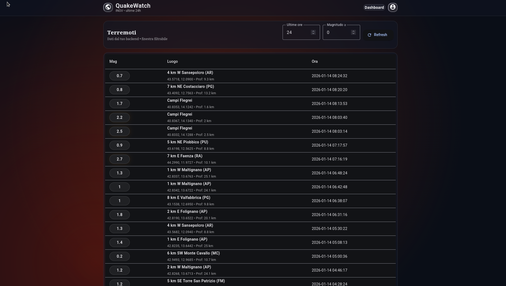
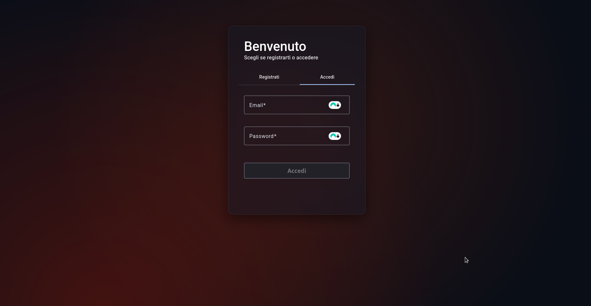
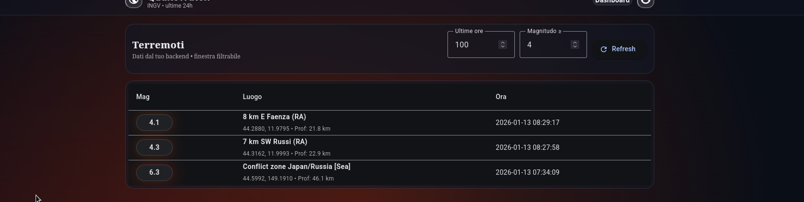

# INGV-Earthquake 🌋

Dashboard web per il monitoraggio dei terremoti INGV  
Backend Flask + Frontend Angular Material

# INGV Earthquake Dashboard (Flask + Angular)

🇮🇹 **Italiano** (scorri sotto per 🇬🇧 English)

---

## 🇮🇹 Descrizione
Questo progetto mostra una dashboard dei terremoti basata su dati INGV.

L’idea chiave è questa:
- **Solo l’admin** può fare “sync” verso INGV (cioè scaricare i nuovi eventi).
- Tutti gli utenti (USER) **non chiamano mai INGV**: leggono solo dal **backend locale**.
- Così, anche se qualcuno spamma il tasto “refresh”, sta spammando **il tuo server**, non il servizio INGV.

---

## 🇮🇹 Architettura
Repository monorepo:
- `be/` → Backend **Flask** (JWT nei cookie + SQLite)
- `fe/` → Frontend **Angular + Angular Material**

---

## 🇮🇹 Funzionalità principali
### Backend (Flask)
- Registrazione e login utenti
- JWT in cookie HttpOnly (più sicuro del token in localStorage)
- Endpoint `GET /api/auth/me` per riconoscere l’utente loggato
- Logout che cancella i cookie JWT
- Sync terremoti (solo ADMIN) e salvataggio nel DB SQLite
- Lettura terremoti dal DB (per utenti normali)

### Frontend (Angular)
- Login/registrazione
- Guard di protezione (JWT cookie → loadMe → currentUser)
- Dashboard con lista terremoti (Material Table) + filtri + refresh
- Navbar “glass” (Material)

---

## 🇮🇹 JWT: come funziona (passo passo)
1. L’utente fa login (`POST /api/auth/login`)
2. Il backend genera:
   - access token
   - refresh token
3. Il backend salva i token nei cookie **HttpOnly**
4. Il frontend non “vede” il cookie (per sicurezza), ma lo invia automaticamente con `withCredentials: true`
5. Il frontend chiama `GET /api/auth/me` per ottenere il profilo e popolare `currentUser`
6. Logout (`POST /api/auth/logout`) → il backend **cancella i cookie**

---

## 🇮🇹 Endpoint principali (backend)
- `POST /api/auth/register` → registrazione
- `POST /api/auth/login` → login + set cookie JWT
- `GET /api/auth/me` → profilo utente dal cookie
- `POST /api/auth/logout` → unset cookie JWT

Terremoti:
- `POST /api/earthquakes/sync` → **solo ADMIN** (scarica da INGV e salva nel DB)
- `GET /api/earthquakes` → lista terremoti dal DB (filtri opzionali)

Filtri `GET /api/earthquakes`:
- `?hours=24` → ultimi N ore
- `?minMag=2.5` → magnitudo minima
- `?limit=200` → massimo risultati (max 1000)

---

## 🇮🇹 Setup: Backend (Flask)
Entra in `be/`:

cd be
python -m venv venv
source venv/bin/activate
pip install -r requirements.txt
python app.py

Il backend parte su:

http://127.0.0.1:5000

Nota: il DB SQLite viene creato automaticamente in be/instance/ (in development).

🇮🇹 Setup: Frontend (Angular)
cd fe
npm install

Proxy per chiamare il backend (evita CORS e semplifica le chiamate)
Crea fe/proxy.conf.json:
{
  "/api": {
    "target": "http://127.0.0.1:5000",
    "secure": false,
    "changeOrigin": true,
    "logLevel": "debug"
  }
}

ng serve --proxy-config proxy.conf.json

Oppure (consigliato) aggiungi lo script in package.json => "start": "ng serve --proxy-config proxy.conf.json"
Lancia => npm start => http://127.0.0.1:4200

🇮🇹 Note sicurezza / repository

Questo repository non include:
file .env
database SQLite be/instance/database.db
node_modules/

🇬🇧 English
Description

This project provides an earthquake dashboard based on INGV data.
Key idea:
Only ADMIN can “sync” data from INGV (download and store new events).
Regular users (USER) never call INGV directly: they only query your backend.
This prevents spam against INGV: users can refresh as much as they want, they only hit your server.
Architecture
Monorepo layout:
be/ → Flask backend (JWT in cookies + SQLite)
fe/ → Angular + Angular Material frontend

Main features
Backend (Flask)
User registration and login
HttpOnly JWT cookies (safer than localStorage tokens)
GET /api/auth/me to restore session from cookies
Logout clears JWT cookies
Earthquake sync (ADMIN only) and storage into SQLite
Earthquake list endpoint served from local DB
Frontend (Angular)
Login / register
Route guards (cookie → loadMe → currentUser)
Dashboard with Material table + filters + refresh button
Glass-style navbar (Material)
JWT flow (step-by-step)
User logs in (POST /api/auth/login)
Backend creates:
access token
refresh token
Backend stores tokens in HttpOnly cookies
Frontend can’t read cookies (by design), but sends them with withCredentials: true
Frontend calls GET /api/auth/me to load user profile into currentUser
Logout (POST /api/auth/logout) clears cookies on backend
Backend endpoints
Auth:

POST /api/auth/register

POST /api/auth/login

GET /api/auth/me

POST /api/auth/logout

Earthquakes:

POST /api/earthquakes/sync → ADMIN only

GET /api/earthquakes → list from DB (optional filters)

GET /api/earthquakes filters:
hours
minMag
limit (max 1000)

Setup: Backend (Flask)
cd be
python -m venv venv
source venv/bin/activate
pip install -r requirements.txt
python app.py
http://127.0.0.1:5000

Setup: Frontend (Angular)
cd fe
npm install

Angular proxy
Create fe/proxy.conf.json:

{
  "/api": {
    "target": "http://127.0.0.1:5000",
    "secure": false,
    "changeOrigin": true,
    "logLevel": "debug"
  }
}

Run Angular with proxy:
ng serve --proxy-config proxy.conf.json
Or set the script in package.json:
"start": "ng serve --proxy-config proxy.conf.json"
Then:
npm start
http://127.0.0.1:4200

Repository notes
This repository intentionally excludes:
.env files
SQLite DB (be/instance/database.db)
node_modules

---
